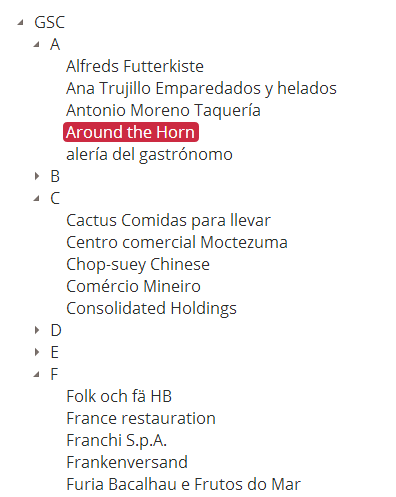

# Creating the Customer Treeview - SalesHub

In this section of the tutorial you'll learn how to create a [Kendo Treeview](http://demos.kendoui.com/web/treeview/index.html)
server-side.

In the SalesHub application, a [Kendo Treeview](http://demos.kendoui.com/web/treeview/index.html) is used to display all of the Customers which belong to a Selling Company. The Selling Company appears as a root node in the Treeview and the Customers for each Selling Company are grouped by
the first character in their name. So the basic structure of the Treeview is: `Selling Company -> Customer Group -> Customer Name`.

When a Customer is selected in the [Kendo Treeview](http://demos.kendoui.com/web/treeview/index.html) the Order's grid is updated to
display only the Orders for the selected Customer. If you would like to learn how the Order's grid is updated depending on the selected
Customer, please read [Filtering Order's Server-Side](kendo-saleshub-filtering-orders-server-side).

The Customer Treeview is located in **Views/Home/Index.cshtml**

## Setting up the Customer Treeview

To generate the Customer Treeview we use the following Razor code:
    
    @using Kendo.Mvc.UI
    @model SalesHub.Client.ViewModels.Client.IndexViewModel
    @functions
    {
        public static Dictionary<string, object> BuildAttributesForItem(SellingCompanyTreeViewItem item)
        {
            var attributes = new Dictionary<string, object>();
            
            if (item.CustomerId.HasValue)
            {
                attributes.Add("data-customer-id", item.CustomerId.Value.ToString());
            }
            if (!String.IsNullOrEmpty(item.Path))
            {
                attributes.Add("data-path", item.Path);
            }
            return attributes;
        } 
    }

    @(Html.Kendo().TreeView().Name("customerTreeView").BindTo(Model.TreeViewRoot.Items, binding => binding
        .For<SellingCompanyTreeViewItem>(mapping => mapping
            .Children(sellingCompanyTreeViewItem => sellingCompanyTreeViewItem.Items)
            .ItemDataBound((item, sellingCompanyTreeViewItem) => {
                item.Text = sellingCompanyTreeViewItem.Text;
                item.Expanded = sellingCompanyTreeViewItem.Expanded;

                var attributes = BuildAttributesForItem(sellingCompanyTreeViewItem);
                foreach (var attr in attributes)
                {
                    item.HtmlAttributes.Add(attr);
                }
            })
        ))
        .Events(events => events.Select("window.SalesHub.CustomerTreeView_Select")))

Let's walk step-by-step through this code and describe what it does.

    @using Kendo.Mvc.UI

In order to use the Kendo UI MVC extensions we must first include the namespace for the extensions in our View. Including
this namespace will cause the `Kendo()` extension method to become available and allow use to create Kendo UI widgets.

    @functions
    {
        public static Dictionary<string, object> BuildAttributesForItem(SellingCompanyTreeViewItem item)
        { // Code... }
    }

Before we create our Treeview we create a helper function that will generate a Dictionary of HTML data attributes and
their corresponding value. This helper function will be used when the Treeview is bound. These HTML data attributes will
eventually be used by our custom client-side code.

    @Html.Kendo().TreeView().Name("customerTreeView")

Here we use the `Kendo()` extension method to tell the Kendo UI MVC extensions that we want it to create a Kendo Treeview
with **customerTreeView** as it's **Name**. When using the Kendo UI MVC extensions the name of a Kendo UI widget is the **id**
of the HTML element that the extensions generate.

Just telling the extensions to generate a Treeview is not all that useful in and of itself. We also need to tell it what
data we want it to bind against the Treeview. With the extensions we can either tell the Treeview to bind against a remote
data-service or have it generate the complete markup for the tree server-side. In our case we have it generate the markup
server-side using the `BindTo` function on a Treevew.

    .BindTo(Model.TreeViewRoot.Items, binding => { // Our custom binding })

Since we already know what data we want in our Treeview when we create it, we take advantage of the **BindTo** function. The
**BindTo** function takes two parameters, the first parameter is the Enumerable that we would like to bind the tree against
and the second paramater is an **Action** that takes a **NavigationBindingFactory** object as its parameter.

    .BindTo(Model.TreeViewRoot.Items,binding =>
        binding.For<SellingCompanyTreeViewItem>(mapping => { // Code to map our SellingCompanyTreeViewItem to a Kendo TreeViewItem. })

We can use this binding factory to iterate over the objects in the Enumerable that we supplied to the **BindTo** function by calling
it's **For** function. The generic type given to this function has to be the same type as the objects which are in the **Enumerable**
that we gave to the **BindTo** function. In our case, the **Enumerable** is a list of **SellingCompanyTreeViewItem**'s. The **For**
function takes an **Action&lt;NavigationBindingBuilder&gt;** as a parameter.

    binding.For<SellingCompanyTreeViewItem>(mapping => mapping
        .Children(sellingCompanyTreeViewItem => sellingCompanyTreeViewItem.Items)
        .ItemDataBound((item, sellingCompanyTreeViewItem) => {
            item.Text = sellingCompanyTreeViewItem.Text;
            item.Expanded = sellingCompanyTreeViewItem.Expanded;

            var attributes = BuildAttributesForItem(sellingCompanyTreeViewItem);
            foreach (var attr in attributes)
            {
                item.HtmlAttributes.Add(attr);
            }
        })

We use the **mapping** object to tell Kendo what property to use on our **SellingCompanyTreeViewItem** when it tries
to render the children of that **SellingCompanyTreeViewItem** and we give it a function to call everytime a Kendo TreeViewItem
is bound to the Treeview.

    .Children(sellingCompanyTreeViewItem => sellingCompanyTreeViewItem.Items)

Is how we tell it where to look for children nodes when it's rendering the Treeview.

    .ItemDataBound((item, sellingCompanyTreeViewItem) => {
        item.Text = sellingCompanyTreeViewItem.Text;
        item.Expanded = sellingCompanyTreeViewItem.Expanded;

        var attributes = BuildAttributesForItem(sellingCompanyTreeViewItem);
        foreach (var attr in attributes)
        {
            item.HtmlAttributes.Add(attr);
        }
    })

The function we give to **ItemDataBound** is called everytime that a Kendo TreeViewItem is bound to the Treeview. The callback function
takes two parameters. The first one is the Kendo TreeViewItem that is being bound to the Treeview and the second parameter is the
**SellingCompanyTreeViewItem** that corresponds to that Kendo TreeViewItem. This is the point where we set the **Text** and the **Expanded** state
of the resulting TreeViewItem.

This is also the point where we call our Razor helper function to generate some HTML data attributes for the items in the Treeview. 

    .Events(events => events.Select("window.SalesHub.CustomerTreeView_Select"))

Since we want to update the Order's grid depending on the selected Customer, we attach an event handler for the **Select** event of
the Treeview. If you'd like to read more on how we handle the **Select** event from the Treeview please read
[Filtering Order's Server-Side](kendo-saleshub-filtering-orders-server-side).

If you inspect the resulting HTML markup using your browsers Developer Tools, you'll notice that a &lt;script&gt; tag was created
and placed after the markup for the Treeview. This script tag was generated by the Kendo UI MVC extensions and contains JavaScript,
which runs automatically when the page is loaded, that turns the markup into an actual Kendo Treeview.

The contents of the script tag should look something like:

    jQuery(function(){jQuery("#customerTreeView").kendoTreeView({"select":window.SalesHub.CustomerTreeView_Select});});

As you can see, the JavaScript generated by the extensions looks for the generated markup based on an **id**. The **id** it
looks for is the same as the **Name** that we gave the Kendo Treeview when we declared it. After it finds the element, it turns
it into a Treeview by calling **kendoTreeView** on it.